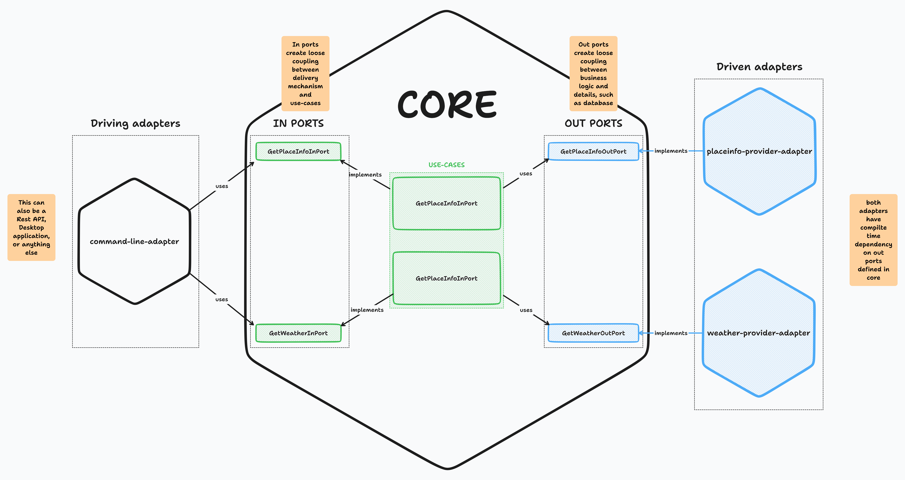

# use-case-app

This is a sample application that demonstrates how to use
the [hexagonal architecture](https://en.wikipedia.org/wiki/Hexagonal_architecture_(software)) in a real-world
application.

## Architecture



What does the application do: it assembles weather and place information from two APIs from https://openweathermap.org/, and displays it in a terminal, either as JSON or as YAML

## How to run the application

A user needs to provide the following information:

| Argument                 | Description                               | Example     |
|--------------------------|-------------------------------------------|-------------|
| `format`                 | An output format. Either `json` or `yaml` | `yaml`      |
| `--latitude`             | A latitude for the place                  | `52.514493` |
| `--longitude`            | A longitude for the place                 | `13.350000` |
| `openweathermap-api-key` | Your API key for `openweathermap`         | `xyz`       |

## Examples

```bash
# Getting a current weather info for Berlin lat/lon in JSON format

$ ./gradlew -q run --args="-k YOUR_KEY_HERE --latitude 51.5128 --longitude -0.0918 -f json"

# Getting a current weather info for Berlin lat/lon in YAML format

$ ./gradlew -q run --args="-k YOUR_KEY_HERE --latitude 51.5128 --longitude -0.0918 -f yaml"
```